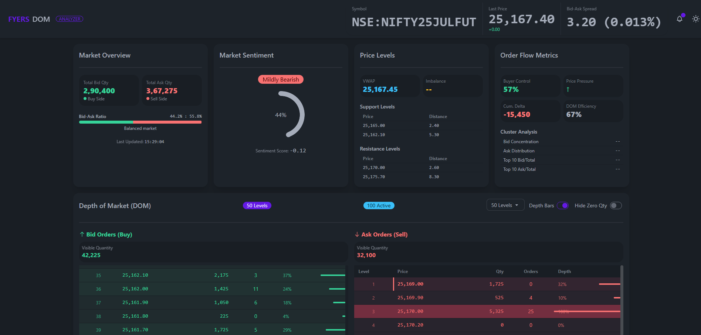
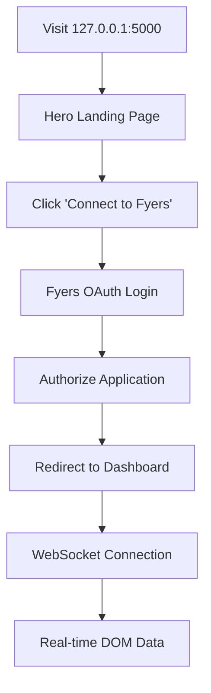

# 📊 Fyers DOM Analyzer

> **Professional-grade Depth of Market analysis platform powered by Fyers TBT Data Feed**

A real-time 50-level DOM analyzer with secure Fyers OAuth integration, advanced order flow analytics, and institutional-quality market depth visualization using high-frequency Tick-By-Tick market data.


## 📸 Live TBT DOM Interface



*Real-time 50-level Depth of Market visualization with TBT data feed showing live bid/ask orders, market sentiment, and order flow analytics for NSE:NIFTY25JULFUT*

## 🚀 Getting Started with Fyers API

### **Step 1: Get Your Fyers API Credentials**

1. **Visit** [Fyers API Portal](https://myapi.fyers.in/) to get your API credentials
2. **Create a new app** to get your API credentials:
   - **App ID**: Your unique application identifier
   - **Secret Key**: Your app's secret key
   - **Redirect URL**: `http://127.0.0.1:5000/fyers/callback`

> **Note**: [myapi.fyers.in](https://myapi.fyers.in/) is specifically for obtaining API credentials and accessing documentation. Your actual trading account should be with Fyers Securities.

### **Step 2: Understanding TBT (Tick-By-Tick) Data Feed**

**TBT Feed** provides real-time, high-frequency market data including:
- **Order Book Updates**: Real-time bid/ask price and quantity changes
- **Market Depth**: 50-level DOM (Depth of Market) data
- **Trade Executions**: Every trade with timestamp, price, and volume
- **Market Statistics**: OHLC, volume, and other market metrics

**Data Frequency**: Up to 1000+ updates per second during active trading
**Latency**: < 10ms from exchange to your application
**Coverage**: NSE, BSE, MCX, and other major Indian exchanges

### **Step 3: API Documentation**

📖 **Complete API Documentation**: [Fyers API v3 Docs](https://myapi.fyers.in/docsv3)

Key sections for DOM analysis:
- **WebSocket API**: Real-time TBT data streaming
- **Market Data**: Depth, quotes, and historical data
- **Authentication**: OAuth 2.0 implementation
- **Order Management**: Place, modify, and cancel orders

> **Important**: [myapi.fyers.in](https://myapi.fyers.in/) is the official API portal for credentials and documentation only. Trading operations require a separate Fyers Securities account.

## 🎯 What is TBT Feed and How Traders Use It

### **What is Tick-By-Tick (TBT) Data?**

TBT data is the most granular form of market data available, containing every price change, order book update, and trade execution as they happen on the exchange. Unlike traditional quote data that may aggregate or sample data, TBT provides:

- **Every bid/ask price change** with exact timestamps
- **Complete order book depth** (50 levels on each side)
- **Real-time trade executions** with volume and price
- **Market microstructure data** for advanced analysis

### **How Professional Traders Use This Tool**

#### **1. Scalping & High-Frequency Trading**
- **Order Flow Analysis**: Identify large orders being placed or removed
- **Market Imbalance Detection**: Spot when buy/sell pressure is building
- **Price Action Prediction**: Anticipate short-term price movements
- **Optimal Entry/Exit Timing**: Execute trades at the best possible prices

#### **2. Institutional Trading**
- **Market Impact Analysis**: Understand how large orders affect prices
- **Execution Quality**: Minimize slippage and market impact
- **Smart Order Routing**: Break large orders into smaller, market-friendly sizes
- **Risk Management**: Monitor position exposure in real-time

#### **3. Market Making & Arbitrage**
- **Spread Analysis**: Identify profitable bid-ask spreads
- **Liquidity Provision**: Provide liquidity where it's needed most
- **Cross-Exchange Arbitrage**: Exploit price differences across exchanges
- **Delta Neutral Strategies**: Hedge positions using real-time Greeks

#### **4. Algorithmic Trading**
- **Pattern Recognition**: Identify recurring market patterns
- **Volume Analysis**: Understand when institutions are active
- **Support/Resistance**: Dynamic levels based on order flow
- **Momentum Trading**: Catch trends as they develop

## 📊 OrderBook Imbalance Analysis

### **Multi-Level Imbalance Metrics**
The application calculates orderbook imbalances at three different depth levels to provide comprehensive market sentiment analysis:

#### **10-Level Imbalance**
- **Purpose**: Short-term momentum and scalping signals
- **Calculation**: (Bid Qty - Ask Qty) / (Bid Qty + Ask Qty) × 100
- **Interpretation**: Quick market sentiment changes for day trading

#### **20-Level Imbalance**
- **Purpose**: Medium-term trend analysis and swing trading
- **Calculation**: Aggregate of top 20 levels on each side
- **Interpretation**: Institution activity and momentum direction

#### **50-Level Imbalance**
- **Purpose**: Long-term sentiment and market structure analysis
- **Calculation**: Full depth analysis for complete market picture
- **Interpretation**: Overall market bias and structural changes

### **Imbalance Interpretation Guide**

| Imbalance Range | Interpretation | Trading Signal |
|----------------|---------------|----------------|
| **> +30%** | Strong Buying Pressure | Bullish momentum - Consider long positions |
| **+15% to +30%** | Moderate Buying Pressure | Mild bullish bias - Wait for confirmation |
| **+5% to +15%** | Slight Buying Pressure | Weak bullish - Monitor for changes |
| **-5% to +5%** | Balanced | Neutral market - Range-bound trading |
| **-15% to -5%** | Slight Selling Pressure | Weak bearish - Monitor for changes |
| **-30% to -15%** | Moderate Selling Pressure | Mild bearish bias - Consider short positions |
| **< -30%** | Strong Selling Pressure | Bearish momentum - Consider short positions |

### **Lot Size Display Toggle**
- **Switch between views**: Number of shares ↔ Lot-based display
- **Accurate lot calculation**: Shows complete lots + remaining shares
- **Trading-friendly format**: "3 lots + 25" for 250 shares with lot size 75
- **Configurable lot size**: Set via `LOT_SIZE` environment variable

## ✨ Key Features

### 🔐 **Secure Authentication**
- **Direct Fyers OAuth 2.0** integration with official API
- **Encrypted database storage** for auth tokens and API credentials
- **Automatic session management** with secure token handling
- **Bank-grade security** with Argon2 password hashing and Fernet encryption

### 📈 **Advanced Market Analysis**
- **50-level DOM visualization** with real-time TBT updates
- **Order flow analytics** with bid-ask ratio analysis
- **Market sentiment indicators** and price level metrics
- **Heat mapping** for order concentration visualization
- **Large order detection** and market imbalance tracking
- **VWAP calculation** and support/resistance levels
- **Price cluster analysis** for institutional order detection
- **OrderBook Imbalance Analysis** at 10, 20, and 50 depth levels with interpretations
- **Lot Size Display Toggle** for switching between shares and lots view

### 🚀 **Real-Time Performance**
- **WebSocket streaming** with millisecond precision TBT data
- **Intelligent data validation** with invalid data correction
- **Connection resilience** with automatic reconnection
- **Optimized logging** for clean monitoring
- **High-frequency updates** supporting 1000+ ticks per second

### 🎨 **Modern UI/UX**
- **Minimalist design** inspired by professional trading platforms
- **Clean, Apple-inspired interface** with smooth animations
- **Responsive design** optimized for all devices
- **Real-time data visualization** with interactive charts
- **Professional color scheme** for extended trading sessions

## 🚀 Quick Start

### 1. **Clone & Setup**
```bash
git clone https://github.com/marketcalls/fyers-websockets.git
cd fyers-websockets
pip install -r requirements.txt
```

### 2. **Configure Environment**
Copy `.env.example` to `.env` and add your Fyers API credentials from [myapi.fyers.in](https://myapi.fyers.in/):

```env
# Fyers API Configuration (Get from https://myapi.fyers.in/)
BROKER_API_KEY=your_fyers_app_id          # Your App ID from Fyers API portal
BROKER_API_SECRET=your_fyers_secret_key   # Your Secret Key from Fyers API portal
REDIRECT_URL=http://127.0.0.1:5000/fyers/callback

# TBT WebSocket Configuration
WEBSOCKET_URL=wss://rtsocket-api.fyers.in/versova  # Fyers TBT data feed endpoint
SYMBOL=NSE:NIFTY25JULFUT                            # Trading symbol for DOM analysis

# Trading Configuration
LOT_SIZE=75                                         # Lot size for the trading symbol

# Database Configuration
DATABASE_URL=sqlite:///fyers_depth.db

# Security (Change in production)
SECRET_KEY=your_flask_secret_key_change_in_production
API_KEY_PEPPER=your_secure_pepper_key_change_in_production
```

> **📝 Note**: Visit [Fyers API Portal](https://myapi.fyers.in/) to create your app and get API credentials. This is for API access only - you'll need a separate Fyers Securities trading account for actual trading.

### 3. **Launch Application**
```bash
python app.py
```

Visit `http://127.0.0.1:5000` and start analyzing market depth! 🎯

> **🔗 First-time Setup**: You'll be redirected to Fyers OAuth login to authenticate your trading account and start receiving TBT data.

## 🔄 Authentication Flow



### **Simplified Flow:**
1. **🏠 Landing Page** → Professional interface explaining DOM Analyzer
2. **🔗 Connect to Fyers** → Secure OAuth 2.0 authentication using API credentials
3. **📊 Dashboard Access** → Real-time 50-level market depth with TBT feed
4. **🔄 Auto-Reconnection** → Seamless WebSocket management for continuous data

## 🗄️ Database Architecture

### **Auth Table** (Encrypted Storage)
```sql
CREATE TABLE auth (
    id INTEGER PRIMARY KEY,
    name VARCHAR(255) UNIQUE NOT NULL,
    auth TEXT NOT NULL,              -- Encrypted auth token
    api_key TEXT,                    -- Encrypted API key
    api_secret TEXT,                 -- Encrypted API secret
    broker VARCHAR(20) DEFAULT 'fyers',
    user_id VARCHAR(255),
    is_revoked BOOLEAN DEFAULT FALSE,
    created_at TIMESTAMP DEFAULT CURRENT_TIMESTAMP,
    updated_at TIMESTAMP DEFAULT CURRENT_TIMESTAMP
);
```

### **Users Table** (Session Management)
```sql
CREATE TABLE users (
    id INTEGER PRIMARY KEY,
    username VARCHAR(255) UNIQUE NOT NULL,
    password_hash TEXT NOT NULL,     -- Argon2 hashed
    email VARCHAR(255) UNIQUE,
    created_at TIMESTAMP DEFAULT CURRENT_TIMESTAMP,
    is_active BOOLEAN DEFAULT TRUE
);
```

## 🛡️ Security Features

| Feature | Implementation | Purpose |
|---------|---------------|---------|
| **OAuth 2.0** | Fyers official API | Secure broker authentication |
| **Token Encryption** | Fernet (AES 128) | Protect stored credentials |
| **Password Hashing** | Argon2 with pepper | Secure password storage |
| **Session Security** | Flask secure sessions | CSRF protection |
| **Data Validation** | Input sanitization | Prevent injection attacks |
| **HTTPS Ready** | SSL/TLS support | Encrypted data transmission |

## 📡 API Endpoints

### **Authentication Routes**
```
GET  /                    → Landing page / Dashboard redirect
GET  /auth/broker         → Fyers OAuth login page
GET  /fyers/callback      → OAuth callback handler
GET  /dashboard           → Main DOM dashboard
GET  /auth/logout         → Logout and token revocation
```

### **API Routes**
```
GET  /api/config          → Application configuration
```

### **WebSocket Events**
```
connect                   → Client connection established
market_depth             → Real-time DOM data updates
test_message             → Connection test message
```

## 📈 Trading Strategies & Use Cases

### **Day Trading with DOM Analysis**

#### **1. Scalping Strategy**
- **Setup**: Monitor 1-5 top levels for quick entries
- **Entry**: When large orders appear on one side, fade the move
- **Exit**: Target 2-3 ticks profit with tight stop-loss
- **Risk**: Use position sizing based on DOM imbalance

#### **2. Momentum Trading**
- **Setup**: Watch for order flow imbalances in direction
- **Entry**: Enter when DOM shows strong directional bias
- **Exit**: Exit when DOM neutralizes or reverses
- **Risk**: Stop-loss beyond significant DOM levels

#### **3. Mean Reversion**
- **Setup**: Identify when DOM shows extreme imbalance
- **Entry**: Counter-trend when DOM reaches extreme levels
- **Exit**: Target return to VWAP or neutral DOM
- **Risk**: Tight stops as DOM can stay imbalanced

### **Institutional Trading Applications**

#### **Smart Order Execution**
- **Order Slicing**: Break large orders based on DOM levels
- **Timing**: Execute during periods of high DOM liquidity
- **Impact**: Minimize market impact using DOM guidance
- **Fill**: Achieve better fills by reading DOM patterns

#### **Risk Management**
- **Position Sizing**: Adjust size based on DOM liquidity
- **Stop Placement**: Use DOM levels for stop-loss placement
- **Market Regime**: Identify high/low volatility periods
- **Exposure**: Monitor real-time P&L impact

### **Market Making Strategies**
- **Spread Trading**: Identify profitable bid-ask spreads
- **Liquidity Provision**: Provide liquidity at key DOM levels
- **Inventory Management**: Balance long/short positions
- **Delta Hedging**: Use DOM for dynamic hedging

## 🔧 Advanced Configuration

### **Environment Variables**
| Variable | Description | Default | Source |
|----------|-------------|---------|---------|
| `BROKER_API_KEY` | Fyers App ID | Required | [myapi.fyers.in](https://myapi.fyers.in/) |
| `BROKER_API_SECRET` | Fyers Secret Key | Required | [myapi.fyers.in](https://myapi.fyers.in/) |
| `REDIRECT_URL` | OAuth callback URL | `http://127.0.0.1:5000/fyers/callback` | Your app settings |
| `WEBSOCKET_URL` | Fyers TBT WebSocket endpoint | `wss://rtsocket-api.fyers.in/versova` | [API Docs](https://myapi.fyers.in/docsv3) |
| `SYMBOL` | Trading symbol for DOM | `NSE:NIFTY25JULFUT` | Exchange format |
| `LOT_SIZE` | Lot size for the symbol | `75` | Depends on trading symbol |
| `DATABASE_URL` | Database connection | `sqlite:///fyers_depth.db` | Local SQLite |
| `SECRET_KEY` | Flask session key | Change in production | Generate secure key |
| `API_KEY_PEPPER` | Encryption pepper | Change in production | Generate secure key |

### **TBT Data Processing**
- **High-Frequency Updates**: Handles 1000+ ticks per second efficiently
- **Invalid Data Correction**: Automatically handles price=0.0 + quantity>0 anomalies
- **Order Book Integrity**: Maintains 50-level depth with data validation
- **Reduced Logging**: Smart logging to prevent console spam during high-frequency updates
- **Connection Resilience**: Auto-reconnection with exponential backoff for TBT stream
- **Market Hours Detection**: Automatically handles market open/close states

## 🚨 Troubleshooting

### **Common Issues & Solutions**

| Issue | Cause | Solution |
|-------|-------|----------|
| **"No active authentication found"** | OAuth not completed | Complete Fyers OAuth flow with your trading account |
| **WebSocket connection fails** | Invalid credentials | Verify `BROKER_API_KEY` and auth token from API portal |
| **Database errors** | Permission issues | Check SQLite file permissions |
| **"Invalid TBT data - preserved price"** | Exchange data quality | Normal - system auto-corrects high-frequency anomalies |
| **Template not found** | Missing dashboard.html | Ensure `templates/dashboard.html` exists |
| **KYC not completed** | Fyers trading account not verified | Complete KYC verification in your Fyers Securities account |
| **App not approved** | API app pending approval | Wait for Fyers to approve your API application at [myapi.fyers.in](https://myapi.fyers.in/) |

### **Debug Mode**
```bash
# Enable detailed logging
python app.py

# Check WebSocket connection
curl -I http://127.0.0.1:5000/api/config

# Verify database
sqlite3 fyers_depth.db ".tables"
```

## 🚀 Production Deployment

### **Security Checklist**
- [ ] Change `SECRET_KEY` and `API_KEY_PEPPER`
- [ ] Use PostgreSQL instead of SQLite
- [ ] Enable HTTPS with SSL certificates
- [ ] Set proper CORS origins
- [ ] Use production WSGI server (gunicorn/uwsgi)
- [ ] Configure reverse proxy (nginx)
- [ ] Set up monitoring and logging
- [ ] Implement rate limiting
- [ ] Regular security updates

### **Docker Deployment**
```dockerfile
FROM python:3.9-slim
WORKDIR /app
COPY requirements.txt .
RUN pip install -r requirements.txt
COPY . .
EXPOSE 5000
CMD ["gunicorn", "--bind", "0.0.0.0:5000", "app:app"]
```

## 📊 Performance Metrics

- **TBT Data Latency**: < 10ms average from exchange
- **Order Book Updates**: 1000+ TBT ticks/second during active trading
- **Memory Usage**: < 100MB typical for 50-level DOM
- **Database Queries**: < 1ms average for auth operations
- **UI Responsiveness**: 60fps animations with real-time updates
- **WebSocket Throughput**: Handles peak market volume efficiently

## 🤝 Contributing

1. Fork the repository
2. Create feature branch (`git checkout -b feature/amazing-feature`)
3. Commit changes (`git commit -m 'Add amazing feature'`)
4. Push to branch (`git push origin feature/amazing-feature`)
5. Open Pull Request

## 📄 License

This project is licensed under the GNU Affero General Public License v3.0 (AGPL-3.0) - see the [LICENSE](LICENSE) file for details.

**Key Points:**
- ✅ **Free to use** for personal and commercial purposes
- ✅ **Modify and distribute** under the same license
- ⚠️ **Network use is distribution** - if you run this on a server, you must provide source code to users
- ⚠️ **Copyleft license** - derivative works must also be AGPL-3.0

## 🙏 Acknowledgments

- **Fyers API** for providing robust TBT data feed and trading infrastructure
- **Flask-SocketIO** for real-time WebSocket communication
- **DaisyUI** for beautiful, accessible UI components
- **SQLAlchemy** for reliable database operations
- **Professional traders** who provided feedback on DOM analysis features

---

<div align="center">

**Built with ❤️ for professional traders**

[🌟 Star this repo](https://github.com/marketcalls/fyers-websockets/stargazers) • [🐛 Report Bug](https://github.com/marketcalls/fyers-websockets/issues) • [💡 Request Feature](https://github.com/marketcalls/fyers-websockets/issues)

</div>